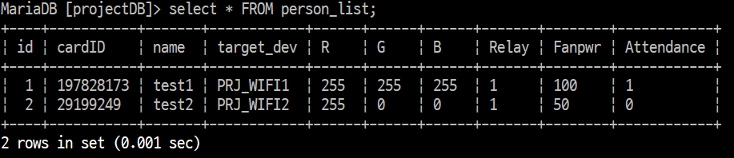
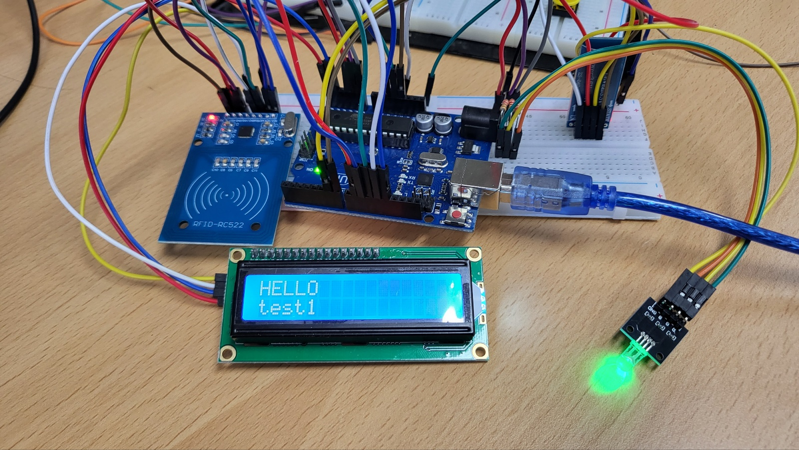

# IoT_OFFICE_PROJECT  
IoT Control OFFICE 프로젝트  

## 설명  
WIFI, BlueTooth를 이용하여 RFID에 등록 여부를 확인 하여 반응 하는 스마트 오피스를 구현하는 프로젝트  

===========================================================

## Project 이미지  
<b><미리 등록한 데이터 베이스></b> 
  
<b><등록된 사용자의 경우 반응></b>  
  
<b><등록 되지 않은 사용자의 경우 반응></b>  
  
 

## 작동 시연 영상  
  
